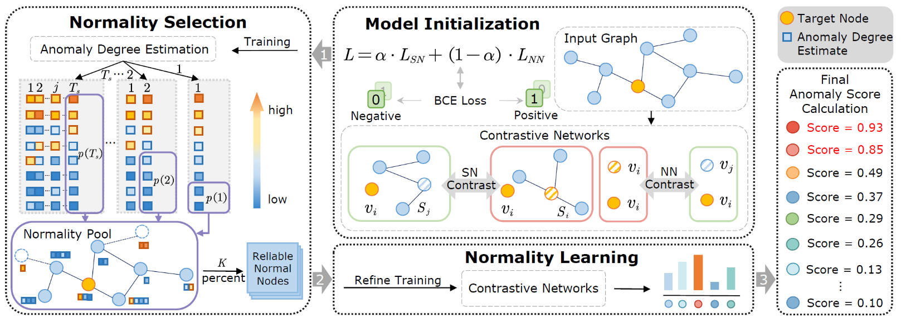

[stars-img]: https://img.shields.io/github/stars/FelixDJC/NLGAD?color=yellow
[stars-url]: https://github.com/FelixDJC/NLGAD/stargazers
[fork-img]: https://img.shields.io/github/forks/FelixDJC/NLGAD?color=lightblue&label=fork
[fork-url]: https://github.com/FelixDJC/NLGAD/network/members
[visitors-img]: https://visitor-badge.glitch.me/badge?page_id=FelixDJC.GRADATE
[adgc-url]: https://github.com/FelixDJC/NLGAD

# Normality Learning-based Graph Anomaly Detection via Multi-Scale Contrastive Learning

<p align="center">   
    <a href="https://pytorch.org/" alt="PyTorch">
      </a>
    <a href="https://aaai.org/Conferences/AAAI-23/" alt="Conference">
        </a>
<p/>


[![GitHub stars][stars-img]][stars-url]
[![GitHub forks][fork-img]][fork-url]


An official source code for paper "Normality Learning-based Graph Anomaly Detection via Multi-Scale Contrastive Learning", accepted by ACM MM 2023. Any communications or issues are welcomed. Please contact jingcan_duan@163.com. If you find this repository useful to your research or work, it is really appreciate to star this repository. :heart:

-------------

### Overview

<p align = "justify"> 
Graph anomaly detection (GAD) has attracted increasing attention in machine learning and data mining. Recent works have mainly focused on how to capture richer information to improve the quality of node embeddings for GAD. Despite their significant advances in detection performance, there is still a relative dearth of research on the properties of the task. GAD aims to discern the anomalies that deviate from most nodes. However, the model is prone to learn the pattern of normal samples which make up the majority of samples. Meanwhile, anomalies can be easily detected when their behaviors differ from normality. Therefore, the performance can be further improved by enhancing the ability to learn the normal pattern. To this end, we propose a normality learning-based GAD framework via multi-scale contrastive learning networks (NLGAD for abbreviation). Specifically, we first initialize the model with the contrastive networks on different scales. To provide sufficient and reliable normal nodes for normality learning, we design an effective hybrid strategy for normality selection. Finally, the model is refined with the only input of reliable normal nodes and learns a more accurate estimate of normality so that anomalous nodes can be more easily distinguished. Eventually, extensive experiments on six benchmark graph datasets demonstrate the effectiveness of our normality learning-based scheme on GAD. Notably, the proposed algorithm improves the detection performance (up to 5.89\% AUC gain) compared with the state-of-the-art methods.


<div  align="center">    
    
</div>

<div  align="center">    
    Figure 1: Overall framework of NLGAD.
</div>


### Requirements

The proposed GRADATE is implemented with python 3.7 on a NVIDIA 3070 GPU. 

Python package information is summarized in **requirements.txt**:

- torch==1.10.2
- dgl==0.4.1
- numpy==1.19.2

### Quick Start

python run.py

### Citation

If you find this project useful for your research, please cite your paper with the following BibTeX entry.

```
@inproceedings{NLGAD,
  title={Normality Learning-based Graph Anomaly Detection via Multi-Scale Contrastive Learning},
  author={Duan, Jingcan and Zhang, Pei and Wang, Siwei and Hu, Jingtao and Jin, Hu and Zhang, Jiaxin and Zhou, Haifang and Liu, Xinwang},
  booktitle={Proceedings of the 31st ACM International Conference on Multimedia},
  pages={7502--7511},
  year={2023}
}
```
